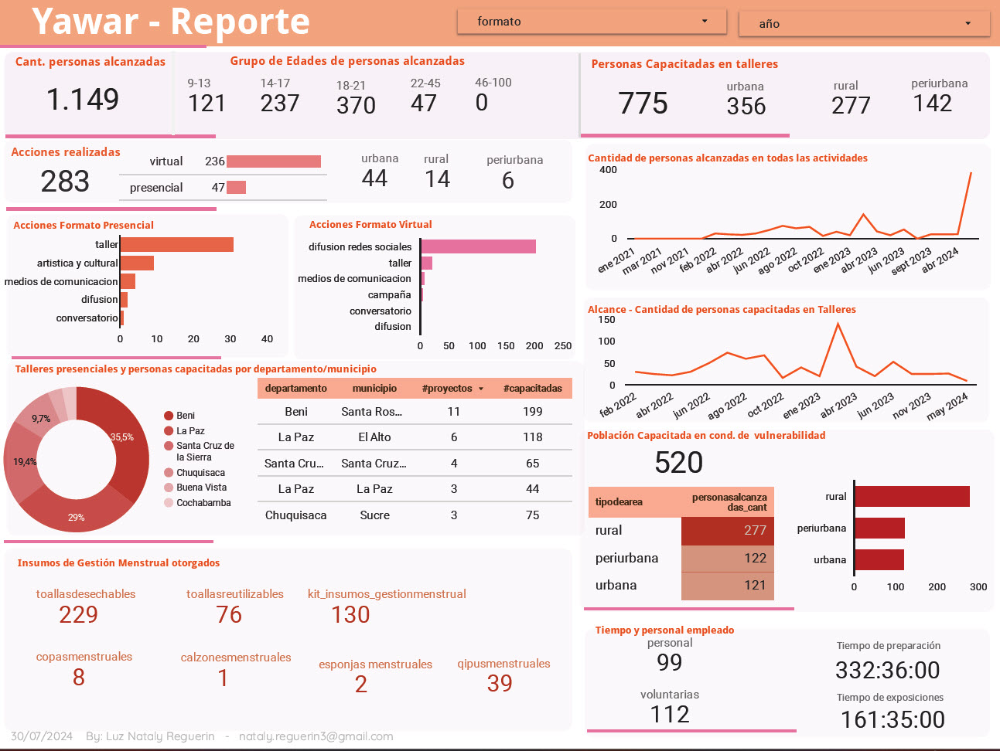

# YAWAR DATA MANAGEMENT PROJECT

## YAWAR information
Yawar is a civil society organization that aims to promote menstrual dignity in Bolivia, as well as to fight against stigmas about menstrual menstrual dignity in Bolivia, in addition to fighting against the stigmas about menstruation, seeking to and political advocacy. To this end, generate alliances with different collectives from different countries that work for the same goal.

## Project Scope and Requirements
### Objective
To improve the visibility of Yawar's actions to civil society and potential partners (funders), as well as to ensure that the data is a quality resource for decision making.
## Data
### Data Sources: 
A first survey of internal information that Yawar had on the workshops provided was considered.
A dataset was progressively assembled through information provided directly by Yawar's promoters and according to the needs of the object of the data project. 
Google Sheets were used.

### Data Collection and Preparation
Once the Yawar staff was able to complete the required columns in Google sheets, the data was cleaned.

Dataset size: 84 x 36

Columns:

'#'
'Año'
'FECHA (dd/mm/aaaa)'
'TIPO ACTIVIDAD (taller, difusion)'
'FORMATO (presencial/virtual)'
'ACTIVIDAD'
'CANTIDAD'
'PAIS'
'CIUDAD'
'ALCANCE\n(nal e internal)'
'LOCALIDAD'
'LUGAR'
'TIPO DE AREA (RURAL/URBANA/PERIURBANA)'
'TIPO DE ESTABLECIMIENTO (GENERICO)'
'OBS'
'CANTIDAD DE PERSONAS ALCANZADAS'
'EDAD'
'TIPO POBLACION (mujeres, jovenes, niñas)'
'VULNERABILIDAD'
'DOTACIÓN INSUMOS'
'toallas desechables'
'copas menstruales'
'toallas reutilizables'
'calzones menstruales'
'Kits Insumos de Gestión Menstrual'
'Q'ipus menstruales'
'DURACION EXPO + PREGUNTAS (MIN)'
'TEMATICA TALLER'
'PERSONAS A CARGO (CAPACITADORAS, ETC)'
'Nro. VOLUNTARIAS PRESENTES'
'TIEMPO DE PREPARACION Y CIERRE (MIN)'
'IMPACTO(ALTO, MEDIO , BAJO)'
'ENCUESTA SOBRE CONOCIMIENTO PREVIO DE MENSTRUACION (si/no)'
'ENCUESTA POSTERIOR DE APRENDIZAJES'
'FINANCIADOR O ORG. ALIADA si hubiera existido'
'DETALLES DE LA ACTIVIDAD (links, obs, etc.)'

### Data cleaning: 

Data cleaning was performed to handle missing values, duplicates and inconsistencies, in addition to performing: data type conversion, upper to lower case modification, elimination of excess spaces.

Data cleaning was performed in Python, using the Pandas library. 

### Data Transformation: 
Transformation and normalization of data into a format suitable for analysis was performed, which included aggregation, filtering, adoption of values (None, 0, N/A) where necessary, elimination of columns unnecessary for analysis, identification of erroneous values and their respective modification, normalization of country, department and city names.

Columns such as 'type of establishment' and by age groups were also added.

Final dataset size: 84 x 40.

Columns:

'#'
'año'
'fecha'
'tipo_actividad'
'formato'
'actividad'
'cantidad'
'pais'
'ciudad'
'alcance'
'localidad'
'lugar'
'tipodearea'	
'tipodeestablecimiento'
'personasalcanzadas_cant'
'edad'
'poblacion'
'vulnerabilidad'
'dotacióninsumos'
'toallasdesechables'
'copasmenstruales'
'toallasreutilizables'
'calzonesmenstruales'
'kit_insumos_gestiónmenstrual'
'qipusmenstruales'
'expo_duracion'
'tematicataller'
'personal'
'voluntarias'
'expo_tiempo_elabtaller'
'org_apoyo'
'tipodeestablecimiento_cat'
'edad_init'
'edad_fin'
'AgeGroup_edad_init'
'9-13'
'14-17'
'18-21'
'22-45'
'46-100'

## Dashboard
Metrics regarding actions performed

* Total number of actions performed
* Number of actions performed by area
* Number of actions performed by format
* Number of actions performed in face-to-face format
* Number of actions carried out in virtual format
* Percentage of workshops conducted in face-to-face format by municipality
* Workshops and people trained by department and municipality in face-to-face format
* Menstrual Management supplies delivered

Metrics with respect to people reached and trained
* Number of people reached 
* Age groups of participants
* People trained in workshops
* People trained in workshops by area
* Number of people reached in all activities
* Reach - Number of people trained in workshops
* Population trained in vulnerable conditions
* Population trained in condition of vulnerability by type of area

Time and Personnel Metrics
* personnel 
* Volunteers
* Preparation time
* Exposure time

## LinkedIn Profile
For any questions regarding about this project contact me.

https://www.linkedin.com/in/luz-nataly-reguerin/

nataly.reguerin3@gmail.com
